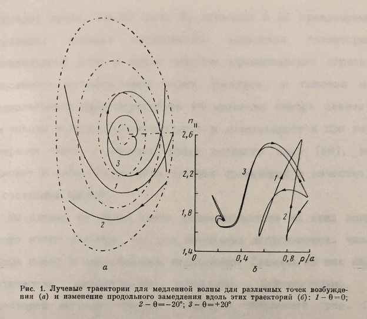
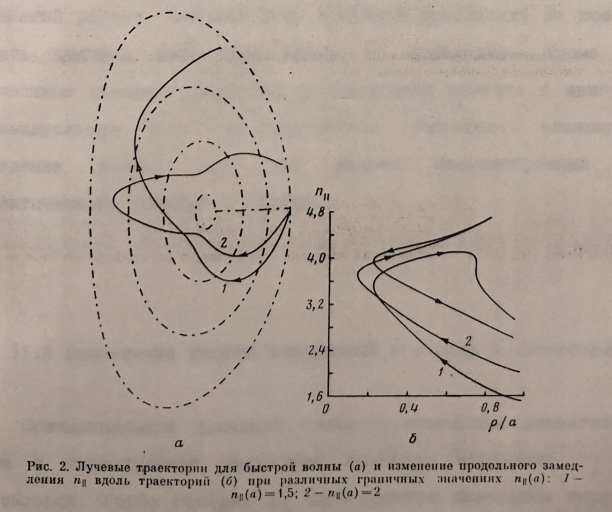

title: Лучевые траектории нижнегибридных волн
---

§1.1 Лучевые траектории нижнегибридных волн

Эффективным методом исследования распространения нижнегибридных волн в неоднородной плазме является метод лучевых
траекторхтй, основанный на квазиклассическом приближении. Это приближение позволяет находить ассимптотические
решения уравнений Максвелла в слабонеоднородной среде. Условие слабой неоднородности подразумевает, что длина волны в плазме должна быть много меньше характерных размеров плазменного образования. Это условие всегда достаточно хорошо удовлетворяется в нижнегибридном диапазоне частот [37]. Формально квази-классическое приближение является естественным обобщением поля по плоским волнам с медленно меняющейся амплитудой и быстро меняющейся фазой:

\[ \vec{E}(r,t)= \vec{E}_0(\vec{r},t)exp[iS(\vec{r},t)],\quad k=\vec{\nabla} S,\quad \omega=-\frac{\partial S}{\partial t}. \]

Низший порядок этого приближения дает уравнения геометрико-оптических лучей:

\begin{equation} 
\frac{d \vec{r}}{d t} = - \frac{\partial H / \partial \vec{k}}{\partial H / \partial \omega}, \quad
\frac{d \vec{k}}{d t} = \frac{\partial H / \partial \vec{r}}{\partial H / \partial \omega}
\tag{1.1}
\end{equation}

где \(Н\) - левая часть дисперсионного уравнения. Уравнения (1.1) определяют форму луча и изменение вдоль него
волнового вектора \(\vec{k}\).
Представляя поле на выходе нижнегибридной антенны - "грилла”- в виде пучка из N лучей с некоторой координатой 
\(\vec{r}_i\) и волновым вектором \(\vec{k}_i (i=1,N)\) и решая для каждого из них уравнения (1.1) можно для любого момента времени t восстановить фронт волны.
Одновременно, уравнения (1.1) определяют изменение вдоль траектории продольной составляющей \(k_{\parallel}\) волнового вектора \(\vec{k}\), которая играет ключевую роль в затухании волны по механизму Ландау. 
Однако сам процесс затухания этими уравнения не описывается. Его учет может быть произведен в следующем порядке квазиклассического приближения,	дающем уравнение для переноса мощности вдоль траектории. 
Оно	может быть записано	в виде:
\(dP/dt=2 \gamma t\), где	\(\gamma\) - декремент	затухания волны, и решаться одновременно с	уравнениями (1.1). 
В дальнейшем мы будем в основном интересоваться системой уравнений (1.1), поскольку для
доли поглощенной мощности волны в зависимости от \(k_{\parallel}\) хорошие аналитические оценки [74].

Для того, чтобы записать уравнения (1.1) для проекций входящих в них векторов необходимо задать систему координат. 
Мы выберем систему \((\rho, \theta, \varphi)\), связанную с магнитными поверхностями. При этом магнитные поверхности задаются уравнением \(\rho = const\), \(\theta\) - здесь полоидальный, а \(\varphi\) - тороидальный угол. Такая система координат была введена в [75] и позволяет удобно задавать форму магнитных поверхностей через широко используемые характеристики-
шафрановский сдвиг \(\Delta\) , эллиптичность \(\lambda\). и треугольность \(\gamma\). Ее связь с обычней цилиндрической системой координат \( (r, \varphi, z) \) дается выражениями:
\begin{equation}
    \begin{aligned} 
        &r = R_0 - \Delta(\rho) + \rho cos(\theta) - \gamma(\rho) sin^2(\theta) \\
        &\varphi = \varphi	 \\
        &z = \lambda(\rho) \rho sin(\theta) 
    \end{aligned}
    \tag{1.2}
\end{equation}

где \(R_0\) - радиус магнитной оси. Функции \( \Delta(\rho),\gamma(\rho) и \lambda(\rho) \) определяют широкий класс магнитных поверхностей и с достаточной точностью позволяют отыскать практически любую равновесную конфигурацию в токамаке.

Теперь небхедимо выразить функцию Н в (1.1) через координаты  \(\rho, \theta, \varphi\) и канонически сопряженные им импульсы (мы используем этот термин, учитывая гамильтонсвскую форму лучевых уравнений, которая является следствием известной аналогии между геометрической оптикой и механикой материальных частиц).

Дисперсионное уравнение в холодной плазме имеет вид [43]:

\begin{equation} 
    H \equiv \varepsilon {N_\perp}^4 
    - [(\varepsilon + \eta)(\varepsilon - {N_\parallel}^2) - g^2] {N_\perp}^2
    +  \eta [(\varepsilon - {N_\parallel}^2)^2 - g^2] = 0
    \tag{1.3}
\end{equation}

Здесь \(N_\parallel=с{k_\parallel}/\omega \), \(N_\perp=с{k_\perp}/\omega \), 
где \(k_\perp\) - составляющая волнового вектора, перпендикулярная магнитному полю, 
\( \varepsilon = K_{x x} = K_{y y}\),	\( g = i K_{xy} = i K_{yx}\), \( \eta = K_{zz}\) - компоненты тензора диэлектрической
проницаемости \(\hat{К}\).
В нижнегибридном диапазоне частот эти компоненты можно положить равными: 
\( \varepsilon = 1 - \omega_{pi}^2 / \omega^2 + \omega_{pe}^2 / \omega_{Be}^2 \),
 \(g = \omega_{pe}^2/\omega\omega_{Be}\), 
 \(\eta = 1 - \omega_{pe}^2/\omega^2\), где \(\omega_{pe}, \omega_{pi}\)- электронная и ионная
плазменные частоты, \(\omega_{Be}\) - электронная циклотронная частота.
Таким образом, неоднородность плазмы входит в компоненты тензора
через плотность плазмы n и магнитное поле \(\vec{B}\). Мы будем считать
плотность постоянной вдоль магнитных поверхностей, то есть
\(n = n(\rho)\). Что касается магнитного поля и физических компонент показателя преломления \(N_\parallel\) и \(N_\perp\) то для того, чтобы выразить их в выбранной системе координат нужно ввести метрический тензор  \(\hat{G}\). 
Используя выражения (1.3) имеем для его элементов:

\begin{equation}
    \begin{aligned} 
        &g_{11} = (-\Delta' + \cos{\theta} - \gamma' \sin^2 \theta)^2 + (\lambda' \rho + \lambda)^2 \sin^2 \theta \\
        &g_{22} = (\rho + 2 \gamma \cos{\theta})^2 \sin^2 \theta + \lambda^2 \rho^2 \cos^2 \theta \\
        &g_{33} = (R_0 - \Delta + \rho \cos \theta - \gamma \sin^2 \theta)^2 \\
        &g_{12} = \lambda \rho (\lambda' \rho + \lambda) \sin \theta \cos \theta - (\Delta' + \cos \theta - \gamma' \sin^2 \theta)(\rho + 2 \gamma \cos \theta) \sin \theta
    \end{aligned}
    \tag{1.4}
\end{equation}
\(g_{i3}=0\) и \(g_{3i}=0\) при \(i\neq3\). 
Записывая уравнение \(div \vec{B}=0 \) в криволинейной системе координат получим 
для контрвариантных компонент магнитного поля \(\vec{В}\):
\begin{equation}
    В^1 = 0,\quad В^2 = \Phi'(\rho)/2 \pi \sqrt g, \quad В^3 = \Psi'(\rho)/2 \pi \sqrt g
    \tag{1.5}
\end{equation}
где \(g = det G \), 
\(\Phi\) и \(\Psi\) - соответственно полоидальный и тороидальный магнитный потоки.
Для того, чтобы установить выражения для импульсов, канонически сопряженных выбранным координатам, 
можно ввести производящую функцию от новых координат и старых импульсов	
\( S(q_i, p_i) = \sum_{i=1}^{3} f_i(q_i)p_i\), 
где \[q_1=p, \quad q_2=\theta, \quad q_3 = \varphi\, \quad p_1 = k_x, \quad p_2 = k_y, \quad p_3 = k_z\]
\(f_i \) - i-oe соотношение (1.2). 
Тогда для новых импульсов 
\[p_i =	\partial S / \partial q_i =  \sum_{i=1}^{3} p_i \partial f_i/ \partial q_i\],
что является определением ковариантных координат вектора \(\vec{k}\) в выбранной системе координат \(k_1, k_2, k_3\). Теперь мы можем записать 

\( k_{\parallel} = \vec{k} \vec{B}/ |\vec{B}| = (k_1 B^1 + k_2 B^2 + k_3 B^3)/|B|\), что учитывая (1.5) дает

\[k_{\parallel} = k_1 \frac{\sin \alpha}{\sqrt g_{22}} + k_2 \cos \alpha / \sqrt g_{33}  \tag{1.6}\]

где \(\alpha\) - угол между \(B_\varphi\)  и полным магнитным полем В. 
Тороидальная компонента магнитного поля \(B_\varphi \) определяется очевидным выражением 
\(B_\varphi = B_0 R_0/\sqrt g_{33}\),
а полоидальная равна 
\( B^2 = B_\theta \sqrt g_{22} = \sqrt{g_{22}/g} \Phi'(\rho) \).

Наконец, к может быть найдено о помощью тождества \(k^2 = \vec{k} \vec{k} = k^2_\parallel + k^2_\perp\).
Записывая векторное произведение в римановом пространстве, задаваемом тензором	\(g_{ik}\) получим

\[ k^2_{\perp} = \sum_{i,k} g^{ik} k_1 k_2  - k^2_\parallel , \tag{1.7}\]

где \(g^{ik}\) - контрвариантный метрический тензор. 
Его элементы определяются выражением: \(g^{ik} = \partial \ln g / \partial g_{ik}\).

Разделив уравнения (1.1) на групповую скорость \(v_g = \partial \omega / \partial \vec{k}\) 
и переходя таким образом от физически неинтересного в данной задаче времени	к длине траектории s получим окончательно:

\begin{equation}
    \begin{aligned} 
        \frac{d\rho}{ds} = - \frac{\partial H / \partial k_1} {|\partial H / \partial \vec{k}|} \quad
        \frac{dk_1}{ds} = \frac{\partial H / \partial \rho}{|\partial H / \partial \vec{k}|}  \\
        \frac{d\theta}{ds} = - \frac{\partial H / \partial k_2} {|\partial H / \partial \vec{k}|} \quad
        \frac{dk_2}{ds} = \frac{\partial H / \partial \theta}{|\partial H / \partial \vec{k}|}  \\
        \frac{d\varphi}{ds} = - \frac{\partial H / \partial k_3} {|\partial H / \partial \vec{k}|} \quad
        \frac{dk_3}{ds} = \frac{\partial H / \partial \varphi}{|\partial H / \partial \vec{k}|}  \\
    \end{aligned}
    \tag{1.8}
\end{equation}

где \(H\) должно быть выражено через канонические импульсы с помощью уравнений (1.6),	(1.7). 
Сразу можно отметить, что в силу тороидальной симметрии системы Н не зависит от тороидального угла \(\varphi\),
соответственно последнее из уравнений (1.8) дает \(k_3=const\). 
Таким образом \(k_3\) сохраняется вдоль траектории, а движение по \(\varphi\) определяется
при известных \(\rho(s), \theta(s), k_1(s), k_2(s) \) прямым интегрированием. 
Поэтому естественно рассматривать проекцию трехмерной траектории на малое сечение токамака плоскость \(\rho, \theta\).

Самым прямым и практически всегда используемым способом нахождения лучевой траектории является 
численное интегрирование соответствующей системы уравнений. 
Нами также была разработана программа, осуществляющая численное решение системы (1.8). 
Она была объединена с равновесным кодом [75], что позволило рассчитывать лучевые траектории
в реалистичной магнитной конфигурации токамака. Примеры подобных рассчетов приведены на рис. 1,2. 
Здесь показаны лучевые траектории для медленной и быстрой волн в проектируемой установке ИТЭР, 
которая характеризуется сильно вытянутой формой магнитных поверхностей. 
Расчеты проводились при следующих параметрах: 
\(R_0=5.2м\), малый радиус \(a=1.8м\), полный тороидальный ток \(I=18мA\),
центральная плотность \(n_0=10^{14}cм^{-3}\), центральная температура \(T_{e0}=30 кэВ\), \(И_0=5.3Тл\).
Частота волны выбиралась таким образом, чтобы она лежала вблизи нижних границ диапазонов, 
где мало поглощение ВЧ мощности на \(\alpha\)-частицах - f < 5ГГц - для медленной волны и f - 1 ГГц для быстрой волны [76].

Рисунки позволяют сделать некоторые практические выводы. Так, плохое проникновение медленной волны к центру плазмы делает ее неэффективной для генерация тока в ИТЭРе; быстрая волна проникает лучше, однако рост \(N_\parallel\) 
приводит к её преждевременному затуханию; сильная зависимость поведения траекторий от полоидального угла в точке запуска принципиально ограничивает возможность использования узких спектров, с помощью которых предполагалась транспортировка ВЧ мощности внутрь плазмы [77]. Зти выводы в целом подтверждаются и детализируются при расчетах генерации тока с помощью более сложного кода [68], который включает в себя код расчета лучевых траекторий в качестве одной из составных частей.

Мы однако не будем здесь останавливаться на этих вопросах. Вместо этого отметим, что при очевидных достоинствах, численный подход имеет и существенные недостатки. Главным из них является фактическая эмпиричность процедуры. Действительно, форма траекторий выглядит весьма сложной и запутанной (рис. 1,2) и численный расчет, выдавая лишь конечный результат, не позволяет понять причины того или иного их поведения. Кроме того, численнное решение уравнений не позволяет выявить в явном виде индивидуальную роль многочисленных факторов, влияющих на поведение волны. Все это делает целесообразным поиск аналитического подхода к задаче.

